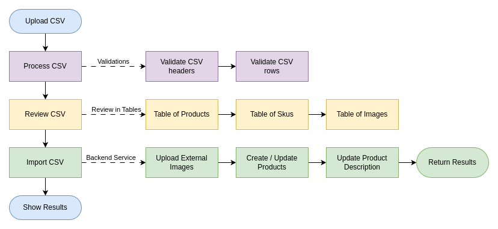
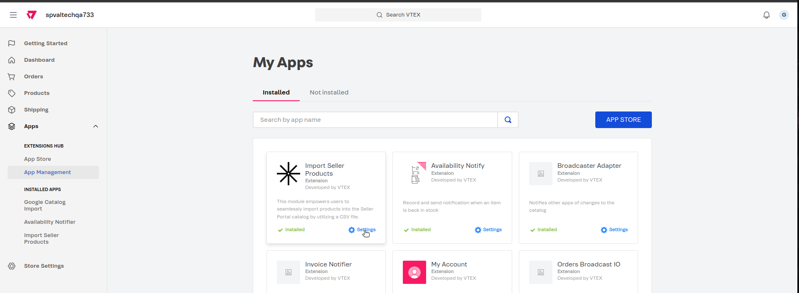
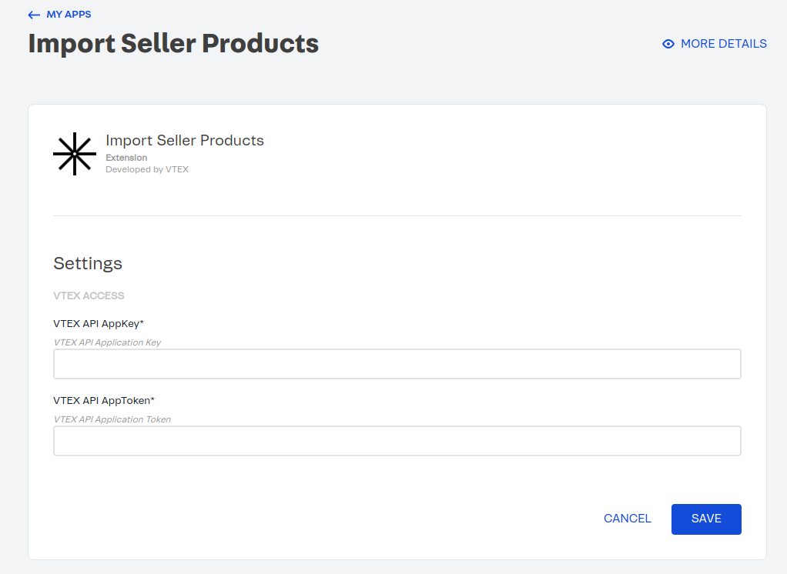
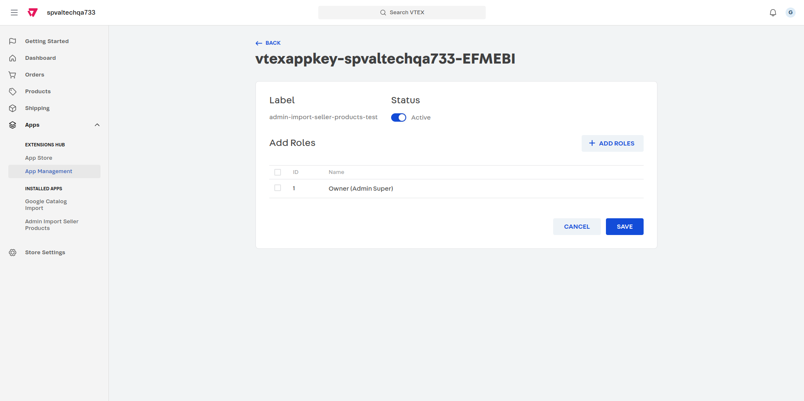
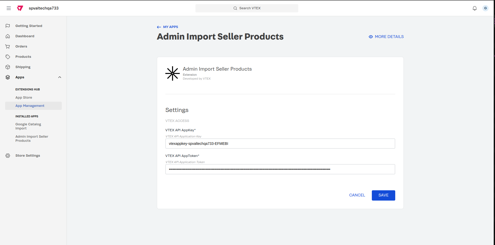

# Admin Import Seller Products 🛒

## 1. Introduction

The **Admin Import Seller Products** module is designed to empower users in seamlessly importing products into the Seller Portal catalog. This process is facilitated through the use of a CSV file, streamlining the product importation process.

To provide a visual guide and enhance your understanding, we've created a comprehensive flowchart illustrating the step-by-step workflow involved in importing products. The following diagram depicts the key stages of the product importation process.

Please refer to the accompanying flowchart for a visual representation of the "Admin Import Seller Products" workflow. Each symbol and connection has been carefully designed to represent a specific action or decision point in the importation journey. Use this guide in conjunction with the detailed instructions in the documentation for a comprehensive understanding of the module's functionality.



---

## 2. Installation

This section provides detailed instructions on how to install and set up the "Admin Import Seller Products" module. Follow the steps below to ensure a successful installation.

### **The installation and the configuration need to be done peer seller.**

#### Installation of `vtex.admin-apps`

To install the `vtex.admin-apps` application, use the following command:

```bash
vtex install vtex.admin-apps
```

This command will integrate the necessary administrative applications into your VTEX environment.

#### Installation of `ageas.admin-import-seller-products`

To install the `ageas.admin-import-seller-products` application, use the following command:

```bash
vtex install ageas.admin-import-seller-products
```

This command will ensure that the module is successfully installed and available for use within your VTEX setup.

---

## 3. Configuration

We need to set the credentials to be able to do the whole process.

1. Go to [https://{sellerAccountName}.myvtex.com/admin/apps](https://{sellerAccountName}.myvtex.com/admin/apps)

2. Open the **Admin Import Seller Products** by clicking on **Settings**:
   

3. In the Admin Import Seller Products settings, locate the fields for **VTEX API AppKey** and **VTEX API AppToken**:
   

4. Generate the credentials with the **Owner (Admin Super)** role on the seller account that you are configuring. Follow the guidelines provided in the documentation.
   

5. Fill in the generated **VTEX API AppKey** and **VTEX API AppToken** in the respective fields.
   

6. Save the changes to apply the new credentials.

By following these steps, you should have successfully configured the necessary credentials for the Admin Import Seller Products application. Ensure that you have the required permissions and roles to generate and apply these credentials.

---

## 4. CSV File Format

Before initiating the import process, ensure your CSV file adheres to the specified format. This section outlines the required structure for a successful import.

If you navigate to the admin module in `https://{sellerAccountName}.myvtex.com/admin/admin-import-seller-products`, you will find a helpful tool.

Click on **Download Example** and a sample CSV file will be downloaded. This file contains a couple of rows with correctly formatted headers or fields that the CSV supports.

Use this example as a reference to structure your CSV file appropriately. Each column in the example represents a specific data field required for successful product importation. Ensure that your CSV file follows a similar structure to avoid any potential issues during the import process.

By adhering to the provided example, you streamline the preparation of your CSV file, making the importation process smoother and more efficient.

Each row in the CSV file symbolizes a single SKU. Therefore, if you intend to add a product with multiple SKUs, each SKU must have a separate row. To signify that different rows are associated with the same product, maintain consistency in the `productId` or `productExternalId`. If these identifiers remain the same across rows, it indicates that the SKUs belong to the same product. Conversely, a change in these identifiers implies a new product.

Let’s review each field:

1. **productId**: This field serves as a unique identifier for each product at VTEX. **If you are performing an update to existing products, you should include this column in your CSV file**. However, **when creating new products, it is crucial to omit this value**. The system will automatically generate a unique identifier (productId) for new products during the creation process.

2. **productExternalId**: This field represents the external identifier for each product. It serves as a unique reference number within the store. The productExternalId allows you to associate your products with external systems or databases. Ensure that each product has a distinct productExternalId to avoid any ambiguity or conflicts in identification. This external identifier aids in efficiently managing and referencing products across various platforms and systems.

3. **productStatus**: This field indicates the status of the product, specifying whether it is `active` or `inactive`. The status determines whether the product is currently available for display and purchase. Use **active** to denote products that are live and ready for customer interaction, while **inactive** can be used for products that are temporarily unavailable or discontinued.

4. **productName**: This field represents the name of the product. It is crucial for product identification and SEO optimization. Ensure that the product name consists of simple and clear words, avoiding complex language or terms in other languages. Additionally, adhere to the 150-character limit to optimize search engine visibility and provide concise yet informative product names for customers. A well-crafted product name contributes to a compelling and effective product presentation.

5. **brandId**: This field contains the identifier for the brand of the product. It represents a unique identifier number associated with the product's brand.

6. **categoryIds**: This field includes the identifier(s) for the category or categories to which the product belongs. Each category or subcategory is assigned a unique identifier number, and a product can be associated with multiple category IDs. The category IDs help organize and classify products within the store, facilitating effective navigation for customers.

7. **productSpecs**: This field contains specifications of the product. The specifications are an array of objects and play a crucial role in differentiating various product SKUs. This field should be represented as an array of objects in the CSV. Each object in the array should include the following attributes:

   - **name (String)**: Specify the name of the specification, providing a distinct attribute for the product. Choose clear and concise names for specifications.
   - **values (Array of Strings)**: Define the possible values associated with the specified attribute. Each value contributes to defining the unique characteristics of the product. Ensure that both keys and values are wrapped in double quotation marks (`"`). The entire JSON array (including all objects) should also be enclosed in double quotation marks.
   - **Example**: `"[{""name"":""Volume"",""values"":[""1l"",""2l""]}]"`

8. **productAttributes**: This field contains attributes of the product. Attributes are additional properties used to create site browsing filters. This field should be represented as an array of objects in the CSV, where each object includes the following attributes:
   - **name (String)**: Specify the name of the attribute. This represents an additional property used to create site browsing filters.
   - **value (String)**: Define the value associated with the specified attribute. This field represents the attribute value. Ensure that both keys and values are wrapped in double quotation marks (`"`). The entire JSON array (including all objects) should also be enclosed in double quotation marks.
   - **Example**: `"[{""name"":""Fabric"",""value"":""Plastic, Hola""}]"`
9. **productSlug**: This field represents a slug or identifier for the product, which is utilized in the URLs of the store. The product slug serves as a reference in the URL, contributing to search engine optimization (SEO) efforts.

10. **productImages**: This field encompasses the URLs or identifiers of images associated with the product. It contains an array of objects providing information about each image:

    - **id (String)**: Represents the unique identifier for the image. This id is necessary to save the image inside VTEX.
    - **url (String)**: Signifies the URL of the image. You have the flexibility to use external URLs, such as those from Google Drive.
      - If the URL is external, we will save the images in VTEX before importing the products. In the case of Google Drive URLs, it is essential to follow this specific format: `https://drive.google.com/uc?id=1YT19jigO7R4W4wLGkvXIngCtrRIol7s1`, where `id` represents the unique identifier associated with the image content
      - If the URL is internal, it should be formatted as `https://{accountName}.vtexassets.com/assets/{path}`
    - **alt (String)**: Describes the alternative text for the image.
    - **Example**: `"[{""id"":""girasol35.png"",""url"":""https://drive.google.com/uc?id=1YT19jigO7R4W4wLGkvXIngCtrRIol7s1"",""alt"":""girasol21""},{""id"":""girasol36.png"",""url"":""https://files.fm/thumb_show.php?i=vd37ymwx5u"",""alt"":""girasol22""}]"`

11. **skuId**: The skuId serves as the distinctive identifier for the SKU. This unique identifier is assigned to each SKU within the system. Importantly, **when creating new skus, it is crucial to omit this value**. The system will autonomously generate a unique `skuId` for new products during the creation process.
    However, **if you are performing updates to existing products, it becomes crucial to include the skuId column in your CSV file**. This identifier is essential for accurately associating modifications with the corresponding SKUs. By understanding this distinction, you contribute to a seamless and error-free product importation process.

12. **skuName**: The `skuName` represents the distinct name assigned to the SKU. This serves as a clear and concise label for the SKU, contributing to effective product differentiation. It is imperative to use straightforward language, avoiding complex terms or languages. The `skuName` is a crucial element for SEO optimization and must adhere to the 150-character limit.

13. **skuExternalId**: The `skuExternalId` serves as an external identifier for the SKU. This unique reference code is crafted to enhance the organization of the store. It provides a valuable means of identification for the SKU in external systems or processes.

14. **skuEan**: The `skuEan` is the EAN (International Article Number) assigned to the SKU. This unique barcode comprises up to 13 numeric characters, providing a standardized identification code for the SKU. The EAN is crucial for accurate and efficient tracking of the SKU across various systems.

15. **skuManufacturerCode**: The `skuManufacturerCode` is the manufacturer code specific to the SKU. This code serves as a reference within the store, facilitating streamlined organization and management of SKU-related information. It is essential for associating the SKU with its respective manufacturer.

16. **skuIsActive**: The `skuIsActive` field indicates the activity status of the SKU. It is a boolean attribute, meaning it accepts either `true` or `false` values.

    - When set to `true`, it signifies that the SKU is active, indicating that it is currently available for purchase.
    - Conversely, when set to `false`, it denotes that the SKU is inactive, implying that it is not available for purchase at the moment.

17. **skuWeight**: The `skuWeight` field represents the weight of the SKU and is specified in grams. It is a numerical attribute, allowing for weights lighter than 1000 grams.

18. **skuDimensions**: The `skuDimensions` field denotes the physical dimensions of the SKU. The dimensions include width, height, and length, allowing you to specify the spatial characteristics of the SKU in a readable format:

    - **width (Number)**: SKU width.
    - **height (Number)**: SKU height.
    - **length (Number)**: SKU length.
    - **Example**: `"{""width"":1.5,""height"":2.1,""length"":1.6}"`

19. **skuSpecs**: The `skuSpecs` field represents the specifications of the SKU and is presented in a potentially JSON format. This field is mandatory but can be nullable if there is only one SKU associated with the product.

    - **name (String)**: Represents the name of the SKU's specification, providing a distinct attribute for the SKU.
    - **value (String)**: Specifies the value associated with the particular specification, contributing to defining the unique characteristics of the SKU.
    - **Example**: `"[{""name"":""Volume"",""value"":""1l""}]"`
    - In this example, the SKU has a specification named `"Volume"` with a corresponding value of `"1l"`. **It's important to note that the values for specifications can be chosen from the productAttributes that were loaded earlier**. If you define more than one `productAttributes`, you will need to provide a value for each one in this `skuSpecs` field.

20. **skuImages**: The `skuImages` field contains the URLs or identifiers of images associated with the SKU. It is an array of SKU image IDs, and these IDs correspond to the images defined in the `productImages` column.

    - **Example**: `"[""girasol35.png""]"`
    - In this example, the SKU image added was the one with the id `"girasol35.png"`. Ensure that the specified IDs match the images you have previously defined in the `productImages` field.

21. **productTransportModal**: Represents the transport modal used for transporting the product.

22. **productTaxCode**: Signifies the tax code associated with the product.

23. **productDescription**: The `productDescription` field is used to provide a detailed description of the product. It supports HTML formatting, allowing you to structure the content as needed.
    - Should you wish to incorporate spaces within the description, it is necessary to encapsulate the entire description within `"`.
    - **Example**: `"<p>Description Example 2</p><p></p><h1>111111</h1><p></p><h3><strong><em>123456789</em></strong></h3>"`

Each column plays a crucial role in providing information about the product and its associated SKUs. Ensure that your CSV file adheres to this structure for a successful import process. If you have any specific questions about a particular column or need further clarification, feel free to ask!

## 4. Modus Operandi

##### Please take a look to the video in this documentation [Modus Operandi](https://absolunet.jira.com/wiki/spaces/MEDI/pages/4124377111/Admin+Import+Seller+Products#4.-Modus-Operandi)

## Contributors ✨

Thanks goes to these wonderful people:

<!-- ALL-CONTRIBUTORS-LIST:START - Do not remove or modify this section -->
<!-- prettier-ignore-start -->
<!-- markdownlint-disable -->
<table>
  <tr>
    <td align="center"><a href="https://github.com/germanBonacchi"><br /><sub><b>Germán Bonacchi</b></sub></a><br /><a href="https://bitbucket.org/lyracons/ageas-visual-category/commits/?author=germanBonacchi" title="Code">💻</a></td>
 </tr>
</table>

<!-- markdownlint-restore -->
<!-- prettier-ignore-end -->

<!-- ALL-CONTRIBUTORS-LIST:END -->
