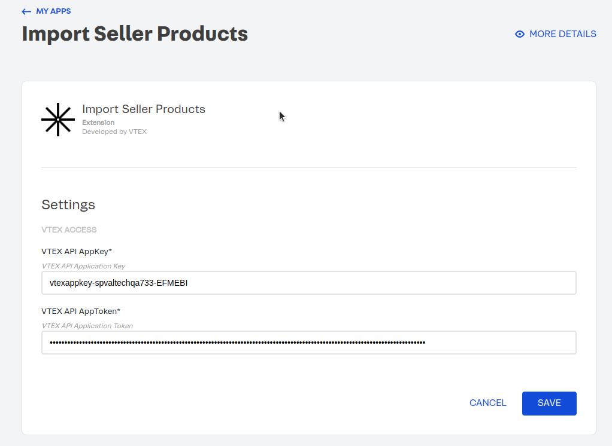
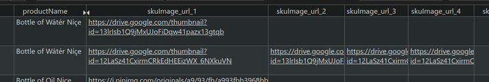
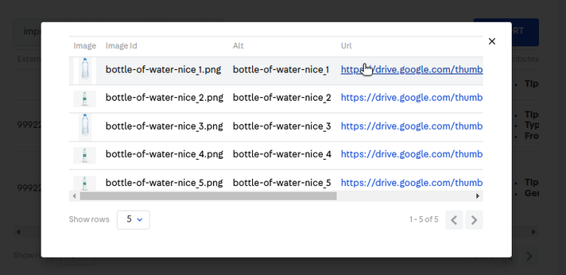

# Import Seller Product 🛒

## 1. Introduction

The **Import Seller Product** module is designed to empower users in seamlessly importing products into the Seller Portal catalog. This process is facilitated through the use of a CSV file, streamlining the product importation process.

To provide a visual guide and enhance your understanding, we've created a comprehensive flowchart illustrating the step-by-step workflow involved in importing products. The following diagram depicts the key stages of the product importation process.

Please refer to the accompanying flowchart for a visual representation of the "Import Seller Product" workflow. Each symbol and connection has been carefully designed to represent a specific action or decision point in the importation journey. Use this guide in conjunction with the detailed instructions in the documentation for a comprehensive understanding of the module's functionality.


---

## 2. Installation

This section provides detailed instructions on how to install and set up the "Import Seller Product" module. Follow the steps below to ensure a successful installation.

### **The installation and the configuration need to be done peer seller by the Marketplace.**

#### Installation of `vtex.admin-apps`

To install the `vtex.admin-apps` application, use the following command:

```bash
vtex install vtex.admin-apps
```

This command will integrate the necessary administrative applications into your VTEX environment.

#### Installation of `ageas.admin-import-seller-products`

To install the `ageas.admin-import-seller-products` application, use the following command:

```bash
vtex install ageas.admin-import-seller-products
```

This command will ensure that the module is successfully installed and available for use within your VTEX setup.

---

## 3. Configuration

We need to set the credentials to be able to do the whole process.

1. Go to [https://{sellerAccountName}.myvtex.com/admin/apps](https://{sellerAccountName}.myvtex.com/admin/apps)

2. Open the **Import Seller Product** by clicking on **Settings**:
   

3. In the Import Seller Product settings, locate the fields for **VTEX API AppKey** and **VTEX API AppToken**:
   

4. Generate the credentials with the **Owner (Admin Super)** role on the seller account that you are configuring. Follow the guidelines provided in the documentation. **This is need to be done by the Seller.**
   

5. Fill in the generated **VTEX API AppKey** and **VTEX API AppToken** in the respective fields.
   

6. Save the changes to apply the new credentials.

By following these steps, you should have successfully configured the necessary credentials for the Import Seller Product application. Ensure that you have the required permissions and roles to generate and apply these credentials.

---

## 4. CSV File Format

Before initiating the import process, ensure your CSV file adheres to the specified format. This section outlines the required structure for a successful import.

If you navigate to the admin module in `https://{sellerAccountName}.myvtex.com/admin/admin-import-seller-products`, you will find a helpful tool.

Click on **Download Example** and a sample CSV file will be downloaded. This file contains a couple of rows with correctly formatted headers or fields that the CSV supports.

Use this example as a reference to structure your CSV file appropriately. Each column in the example represents a specific data field required for successful product importation. Ensure that your CSV file follows a similar structure to avoid any potential issues during the import process.

By adhering to the provided example, you streamline the preparation of your CSV file, making the importation process smoother and more efficient.

Each row in the CSV file symbolizes a single SKU. Therefore, if you intend to add a product with multiple SKUs, each SKU must have a separate row. To signify that different rows are associated with the same product, maintain consistency in the productId or productExternalId or productName. If these identifiers remain the same across rows, it indicates that the SKUs belong to the same product. Conversely, a change in these identifiers implies a new product.

Let’s review each field:

1. **productId**: This field serves as a unique identifier for each product at VTEX. **If you are performing an update to existing products, you should include this column in your CSV file**. However, **when creating new products, it is crucial to omit this value**. The system will automatically generate a unique identifier (productId) for new products during the creation process.

2. **productExternalId**: This field represents the external identifier for each product. It serves as a unique reference number within the store. The productExternalId allows you to associate your products with external systems or databases. Ensure that each product has a distinct productExternalId to avoid any ambiguity or conflicts in identification. This external identifier aids in efficiently managing and referencing products across various platforms and systems.

3. **productName**: This field represents the name of the product. It is crucial for product identification and SEO optimization. Ensure that the product name consists of simple and clear words, avoiding complex language or terms in other languages. Additionally, adhere to the 150-character limit to optimize search engine visibility and provide concise yet informative product names for customers. A well-crafted product name contributes to a compelling and effective product presentation.

4. **brandId**: This field contains the identifier for the brand of the product. It represents a unique identifier number associated with the product's brand.

5. **categoryIds**: This field includes the identifier(s) for the category or categories to which the product belongs. Each category or subcategory is assigned a unique identifier number, and a product can be associated with multiple category IDs. The category IDs help organize and classify products within the store, facilitating effective navigation for customers.

| **productAttributes** contains attributes of the product. Attributes are additional properties used to create site browsing filters. This field was divided into: |
| ----------------------------------------------------------------------------------------------------------------------------------------------------------------- |
| **productAttributes_name_1** related to **productAttributes_value_1**                                                                                             |
| **productAttributes_name_2** related to **productAttributes_value_2**                                                                                             |
| **productAttributes_name_3** related to **productAttributes_value_3**                                                                                             |
| **...**                                                                                                                                                           |
| **productAttributes_name_10** related to **productAttributes_value_10**                                                                                           |

6. **productAttributes_name_1 (Required)**: Specify the name of the attribute.

   - **Example**: `Fabric`

7. **productAttributes_value_1 (Required)**: Define the value associated with the specified attribute defined on the `productAttributes_name_1`.

   - **Example**: `Plastic`

8. **productAttributes_name_2**: Specify the name of the attribute.

   - **Example**: `Gender`

9. **productAttributes_value_2**: Define the value associated with the specified attribute defined on the `productAttributes_name_2`.

   - **Example**: `Feminine`

10. **productAttributes_name_3**: Specify the name of the attribute.

    - **Example**: `From`

11. **productAttributes_value_3**: Define the value associated with the specified attribute defined on the `productAttributes_name_3`.

    - **Example**: `China`

12. **productAttributes_name_4 … productAttributes_name_10**: Specify the name of the attribute.

13. **productAttributes_value_4 … productAttributes_value_10**: Define the value associated with the specified attribute defined on the `productAttributes_name_X`.

14. **skuId**: The skuId serves as the distinctive identifier for the SKU. This unique identifier is assigned to each SKU within the system. Importantly, **when creating new skus, it is crucial to omit this value**. The system will autonomously generate a unique `skuId` for new products during the creation process.
    However, **if you are performing updates to existing products, it becomes crucial to include the skuId column in your CSV file**. This identifier is essential for accurately associating modifications with the corresponding SKUs. By understanding this distinction, you contribute to a seamless and error-free product importation process.

15. **skuExternalId**: The `skuExternalId` serves as an external identifier for the SKU. This unique reference code is crafted to enhance the organization of the store. It provides a valuable means of identification for the SKU in external systems or processes.

16. **skuEan**: The `skuEan` is the EAN (International Article Number) assigned to the SKU. This unique barcode comprises up to 13 numeric characters, providing a standardized identification code for the SKU. The EAN is crucial for accurate and efficient tracking of the SKU across various systems.

| **skuImage_url** encompasses URLs of images associated with the sku. This this images will be assign on each SKU. This field was divided into: |
| ---------------------------------------------------------------------------------------------------------------------------------------------- |
| **skuImage_url_1**                                                                                                                             |
| **skuImage_url_2**                                                                                                                             |
| **. . .**                                                                                                                                      |
| **skuImage_url_10**                                                                                                                            |

17. **skuImage_url_1 (Required)**: Signifies the URL of one image of this `sku`. You have the flexibility to use external URLs, such as those from Google Drive.

    - If the URL is external, we will save the images in VTEX before importing the products. In the case of Google Drive URLs, it is essential to follow this specific format: `https://drive.google.com/thumbnail?id={id}`, where id represents the unique identifier associated with the image content. **Example**: [https://drive.google.com/thumbnail?id=1YT19jigO7R4W4wLGkvXIngCtrRIol7s1](https://drive.google.com/thumbnail?id=1YT19jigO7R4W4wLGkvXIngCtrRIol7s1)
    - If the URL is internal, it should be formatted as `https://{accountName}.vtexassets.com/assets/{path}`. **Example**: [https://spvaltechqa733.vtexassets.com/assets/vtex.catalog-images/products/water_img_1\_\_\_128a77fee20713a5b8b69da81912fb82.png](https://spvaltechqa733.vtexassets.com/assets/vtex.catalog-images/products/water_img_1___128a77fee20713a5b8b69da81912fb82.png)

18. **skuImage_url_2 … skuImage_url_10**: Represents the URL of the image. You have the flexibility to use external URLs, such as those from Google Drive.

19. **skuWeight**: The `skuWeight` field represents the weight of the SKU and is specified in grams. It is a numerical attribute, allowing for weights lighter than 1000 grams.

20. **skuWidth (Required)**: The `skuWidth` field represents the width of the SKU.

    - **Example**: `1.5`

21. **skuHeight (Required)**: The `skuHeight` field represents the height of the SKU.

    - **Example**: `2.0`

22. **skuLength (Required)**: The `skuLength` field represents the length of the SKU.

    - **Example**: `1.7`

| **skuSpecs** represents the specifications of the SKU. This field is mandatory but can be nullable if there is only one SKU associated with the product. This field was divided into: |
| ------------------------------------------------------------------------------------------------------------------------------------------------------------------------------------- |
| **skuSpecs_name_1** related to **skuSpecs_value_1** and **productImages_alt_1**                                                                                                       |
| **skuSpecs_name_2** related to **productImages_url_2** and **skuSpecs_value_2**                                                                                                       |
| **skuSpecs_name_3 … skuSpecs_name_5** related to **productImages_url_3 … productImages_url_5** and **skuSpecs_value_3 … skuSpecs_value_5**                                            |

23. **skuSpecs_name_1 (Required)**: Represents the name of the SKU's specification, providing a distinct attribute for the SKU.

    - **Example**: `Color`

24. **skuSpecs_value_1 (Required)**: Specifies the value associated with the particular specification defined on `skuSpecs_name_1`, contributing to defining the unique characteristics of the SKU.

    - **Example**: `White`

25. **skuSpecs_name_2**: Represents the name of the SKU's specification, providing a distinct attribute for the SKU.

    - **Example**: `Size`

26. **skuSpecs_value_2**: Specifies the value associated with the particular specification defined on `skuSpecs_name_2`, contributing to defining the unique characteristics of the SKU.

    - **Example**: `M`

27. **skuSpecs_name_3 … skuSpecs_name_5**: Represents the name of the SKU's specification, providing a distinct attribute for the SKU.

    - **Example**: `Fabric`

28. **skuSpecs_value_3 … skuSpecs_value_5**: Specifies the value associated with the particular specification defined on `skuSpecs_name_X`, contributing to defining the unique characteristics of the SKU.

    - **Example**: `Cotton`

29. **productDescription**: The `productDescription` field is used to provide a detailed description of the product. It supports HTML formatting, allowing you to structure the content as needed.
    - Should you wish to incorporate spaces within the description, it is necessary to encapsulate the entire description within `"`.
    - **Example**: `"<p>Description Example 2</p><p></p><h1>111111</h1><p></p><h3><strong><em>123456789</em></strong></h3>"`

### 4.1. Calculated Columns

In the latest update [1.3.0] on April 26, 2024, significant changes have been implemented in the import process of the app. Notably, some columns have been removed from the CSV format, while new calculated columns have been introduced within the app's logic. These calculated columns are generated dynamically based on existing data or specific rules outlined in the update. Below, you'll find comprehensive details regarding these newly added calculated columns:

1. **productSlug**: The product slug column generates a unique slug for each product based on the product name. Special characters are removed, and spaces are replaced with hyphens (-). Additionally, any accented characters are normalized (e.g., á becomes a, ç becomes c).

2. **productSpecs**: The product specs column aggregates the specifications of each SKU associated with the product. Product Specs = Concatenation of SKU Specs for each sku of the same product.

3. **productStatus**: The product status column indicates the status of each product, which is **always set as active**.

4. **productImages**: Each row will have a couple of `skuImage_url` encompasses URLs of images associated with the SKU.

   - If multiple SKUs belong to the same product, the images of each SKU are accumulated to generate the productImages.
   - The `imageId` of each `productImage` is generated from `productName` normalized + `_X` (where X is the number of image) + `.png`.
   - The `imageAlt` of each `productImage` is generated from `productName` normalized + `_X` (where X is the number of image).
   - Example:
     - CVS:
       
     - Result:
       

5. **skuIsActive**: The SKU is active column indicates whether each SKU is active, which is **always set as true**.

6. **skuName**: The SKU name column generates a descriptive name for each SKU based on the product name and the values of the SKU specs.
   - Lets say the product name is T-Shirt and the SKU specs are White/Black and S/M/L the skus name should be like:
     - T-Shirt **White S**
     - T-Shirt **White M**
     - T-Shirt **White L**
     - T-Shirt **Black S**

Each column plays a crucial role in providing information about the product and its associated SKUs. Ensure that your CSV file adheres to this structure for a successful import process. If you have any specific questions about a particular column or need further clarification, feel free to ask!

## 4. Modus Operandi

##### Please take a look to the video in this documentation [Modus Operandi](https://absolunet.jira.com/wiki/spaces/MEDI/pages/4124377111/Admin+Import+Seller+Products#4.-Modus-Operandi)

## Contributors ✨

Thanks goes to these wonderful people:

<!-- ALL-CONTRIBUTORS-LIST:START - Do not remove or modify this section -->
<!-- prettier-ignore-start -->
<!-- markdownlint-disable -->
<table>
  <tr>
    <td align="center"><a href="https://github.com/germanBonacchi"><br /><sub><b>Germán Bonacchi</b></sub></a><br /><a href="https://bitbucket.org/lyracons/ageas-visual-category/commits/?author=germanBonacchi" title="Code">💻</a></td>
 </tr>
</table>

<!-- markdownlint-restore -->
<!-- prettier-ignore-end -->

<!-- ALL-CONTRIBUTORS-LIST:END -->
